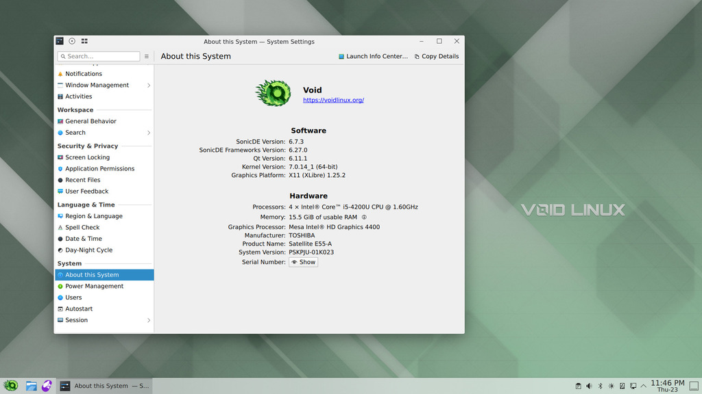

# SonicDE Packages for Void Linux Systems [](#)

This third-party repository provides [SonicDE](https://sonicde.org) x86_64 binary packages for [Void Linux](https://voidlinux.org)-based distributions. SonicDE, or the Sonic Desktop Environment, aims to preserve and improve the X11-specific aspects of KDE. You can learn more about SonicDE at [sonicde.org](https://sonicde.org/).

The packages of this repository are known to work with [Void Linux](https://voidlinux.org), [LazyLinux](https://lazylinuxos.github.io). The functionality needs to be verified on other derivatives.

## Installing SonicDE

### Adding the repository

Make sure xbps.d directory exists:

```shell
sudo mkdir -p /etc/xbps.d
```

Create config file and add repository:

```shell
printf "repository=https://github.com/sonicde-void/sonicde-void/releases/latest/download/\n" | sudo tee /etc/xbps.d/99-repository-sonicde.conf
```

Synchronize the repository and accept the fingerprint (Y):

```shell
sudo xbps-install -S
```

Install SonicDE itself by installing the `sonicde-meta` package:

```shell
sudo xbps-install sonicde-meta
```

The included packages will replace any of their installed KDE counterparts. When asked, just answer with `y`.

### Manual build

For manual build follow Void Linux official documentation: [void-packages](https://github.com/void-linux/void-packages).

## Getting in Contact

Please report any enhancement requests or issues with this repository at [Issues · sonicde-void/sonicde-void](https://github.com/sonicde-void/sonicde-void/issues). In case you need help, want to report success or talk about other aspects, please also check the official SonicDE channels.

&nbsp;[Bluesky](https://bsky.app/profile/sonicdesktop.bsky.social)&nbsp; &nbsp;[Discord](https://discord.gg/cNZMQ62u5S) &nbsp; &nbsp;[Mastodon](https://mastodon.social/@sonicdesktop) &nbsp; &nbsp;[Matrix](https://matrix.to/#/#sonicdesktop:matrix.org) &nbsp; &nbsp;[OFTC IRC](https://webchat.oftc.net/?channels=sonicde%2Csonicde-devel%2Csonicde-dist&uio=MT11bmRlZmluZWQb1) &nbsp; &nbsp;[Telegram](https://t.me/sonic_de) &nbsp; &nbsp;[X (Twitter)](https://x.com/SonicDesktop)
